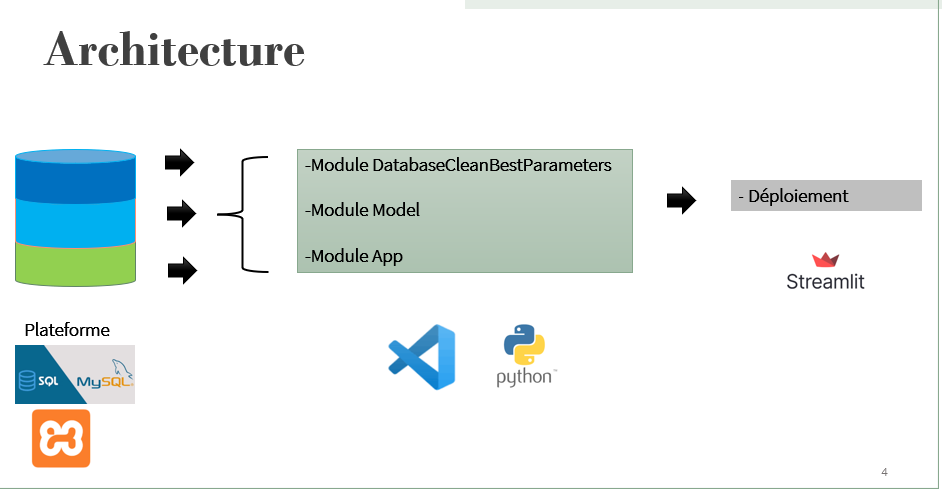

# MyGeeks

# Sujet : L’IA AU SERVICE DE LA TRANSITION ÉNERGÉTIQUE DES ENTREPRISES

Installation

Pour bien démarrer, créer un environment virtuelle pour installer les dépendances.

``` python -m venv venv ```

Une fois l'environnement créé, procédez à l'installation des dépendances.

``` python install -r requirements.txt ```


Ensuite suivez la procedure de l'architecture 




## Étapes pour exécuter le code

Les étapes de ce code sont simples et compréhensibles :

1. **Étape 1 - Chargement des données :** Utilisez le module `DatabaseCleanBestParameters` pour importer les données depuis une base de données ou un entrepôt de données nommé "platform".

2. **Étape 2 - Entraînement du modèle :** Utilisez le module `model.py` pour entraîner les données si vous en avez plus disponibles. Enregistrez ensuite votre modèle ainsi que le vecteuriseur (TF-IDF).

3. **Étape 3 - Lancement de l'application :** Utilisez le module `app.py` pour lancer votre application. Vous pourriez entrer une description, puis l'application prédira le code identifiant associé.
